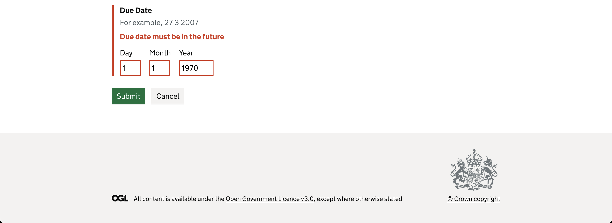

# HMCTS Developer Test

This is a response to the [HMCTS coding task](https://github.com/hmcts/dts-developer-challenge) implementing a basic task manager for caseworkers with CRUD operations and a GOV.UK-based UI.

## Setup

### Using Docker

This project uses Docker Compose. The system can be ran with:

```bash
docker-compose up --build
```

The page can then be accessed at `https://localhost:3100`

### Manual setup

Alternatively, you can run the backend and frontend separately:

```bash
cd backend
uvicorn app.main:app --reload
```
```bash
cd frontend
export BACKEND_URL='http://localhost:8000`
yarn install
yarn webpack
yarn start
```

Again, the service will be accessible at `https://localhost:3100`

## Tech Stack

### Backend
- Python
- FastAPI
- SQLite
> Note: SQLite was used for development speed only and can be swapped out for a more production-friendly database easily thansk to SQLAlchemy.

### Frontend
- GOV.UK Design System
- Typescript
- Express
- Nunjucks

## Testing

### Backend

Unit tests for all endpoints can be ran with `pytest` in the backend directory.

### Frontend

Due to time constraints, not all frontend tests have been implemented. Nevertheless, some tests can be ran with `yarn test`

## Functionality

### Splash screen


### Task list


### Task Details


### Update Task Status


### Create Task


### Error Reporting



